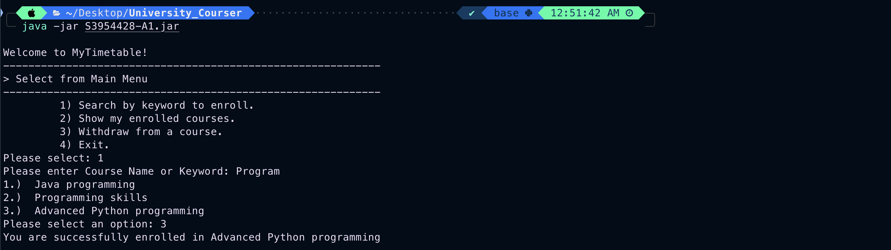
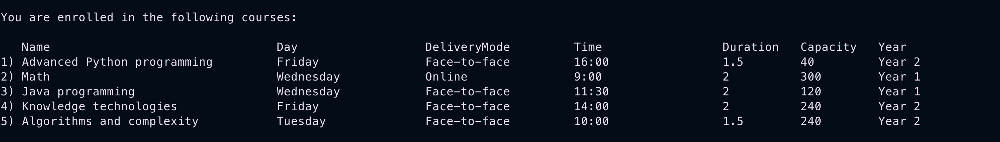

# Smart Course Enroll ✅

SmartEnroll is a simple Java program that allows users to search for courses, enroll in courses, view their enrolled courses, and withdraw from courses. The program reads course information from a CSV file and provides a user-friendly interface for managing course schedules from the command line.

## Table of Contents

- [Features](#features)
- [Getting Started](#getting-started)
  - [Prerequisites](#prerequisites)
  - [Installation](#installation)
- [Demo](#demo)
- [Usage](#usage)
  - [Searching for Courses](#searching-for-courses)
  - [Enrolling in Courses](#enrolling-in-courses)
  - [Viewing Enrolled Courses](#viewing-enrolled-courses)
  - [Withdrawing from Courses](#withdrawing-from-courses)
- [Project Structure](#project-structure)
- [Contributing](#contributing)

## Features

- Search for courses by keyword.
- Enroll in courses.
- View enrolled courses with details.
- Withdraw from enrolled courses.

## Getting Started

### Prerequisites

Make sure you have the following software installed on your machine:

- Java Development Kit (JDK)
- Java Runtime Environment (JRE)

### Installation

1. Clone the repository:

   ```bash
   git clone https://github.com/Git-With-Chris/SmartEnroll.git
   ```
2. Compile the Java files:

   ```bash
   javac Program/A1/*.java
   ```
   
## Demo





## Usage

Run the program using the following command:

```bash
java -jar SmartEnroll.jar
```

### Searching for Courses
1. Select option 1 from the main menu.
2. Enter the course name or keyword to search.

### Enrolling in Courses
1. After searching, select the desired course from the list.
2. Confirm the enrollment.

### Viewing Enrolled Courses
1. Select option 2 from the main menu.

### Withdrawing from Courses
1. Select option 3 from the main menu.
2. Choose the course to withdraw from.

## Project Structure

```plaintext
.
├── SmartEnroll.jar
├── course.csv
├── files
│   ├── bin
│   │   ├── Program
│   │   │   └── A1
│   │   │       ├── Course.class
│   │   │       ├── CourseDetails.class
│   │   │       ├── CourseTest.class
│   │   │       └── Main.class
│   │   └── module-info.class
│   └── src
│       ├── Program
│       │   └── A1
│       │       ├── Course.java
│       │       ├── CourseDetails.java
│       │       ├── CourseTest.java
│       │       └── Main.java
│       └── module-info.java
└── images
    ├── MainPage.png
    ├── Option1.png
    └── Option2.png

9 directories, 15 files

```

## Contributing
Contributions are welcome! Please follow the contribution guidelines.
